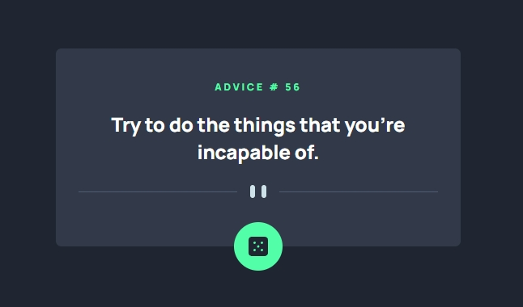

This is a solution to the [Advice generator app challenge on Frontend Mentor](https://www.frontendmentor.io/challenges/advice-generator-app-QdUG-13db).

### The challenge

Users should be able to:

- View the optimal layout for the app depending on their device's screen size
- See hover states for all interactive elements on the page
- Generate a new piece of advice by clicking the dice icon

### Screenshot

### Links

- Solution URL: [Click](https://eugiss.github.io/advice-generator-app/)

## My process

### Built with

- Semantic HTML5 markup
- CSS custom properties
- JS
- Flexbox
- Mobile-first workflow

### What I learned

I am learning to work with API

## Author

- Frontend Mentor - [@Evgi](https://www.frontendmentor.io/profile/EvgiSs)
